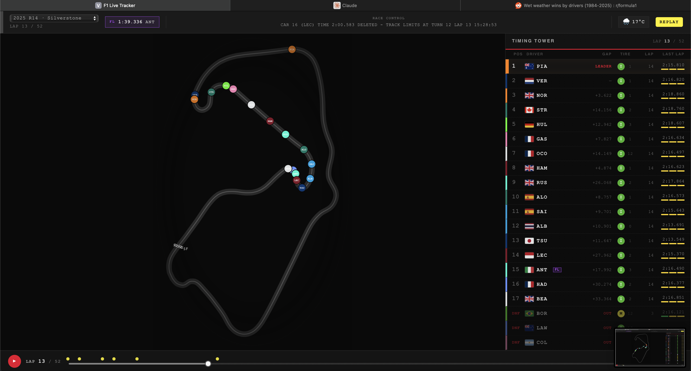
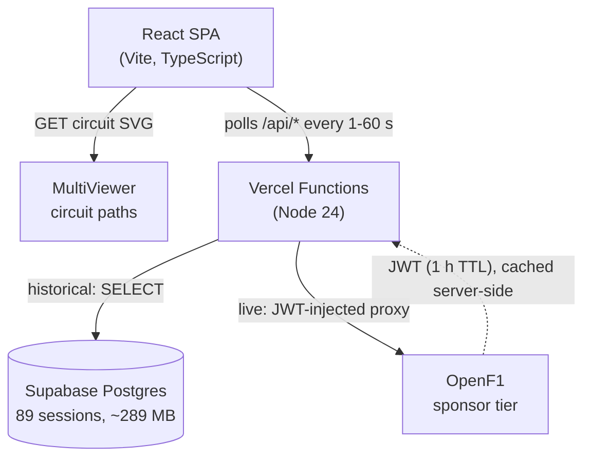

# F1 Live Tracker

**Real-time Formula 1 race tracker. Live driver positions on an SVG circuit map, broadcast-style timing tower, replay scrubber across 89 historical races.**

[**Try the tracker →**](https://f1-live-tracker.vercel.app)



https://github.com/user-attachments/assets/882b66b3-a962-4d6b-a722-1c3f2adda93c


---

## What it does

- Driver positions update **every second** on an SVG circuit map sized to each track's natural aspect ratio.
- Timing tower: gap to leader, current tire compound and age, last lap time with **fastest-lap purple**, and **per-sector micro-chips** (overall best, personal best, or slower).
- **Replay scrubber** across 89 historical race weekends from 2023 to 2025, with safety-car and red-flag event markers on the rail.
- **DNF, NC, and DNS classification** inferred from `/laps` data. OpenF1 does not expose a classification field, so the app derives it from lap-count gaps and duration timestamps.
- Live weather pill: air temperature plus a sky icon, with track temperature, humidity, and wind on hover.
- Race control feed (FIA messages, sector flags, safety-car deployments) in the header strip.

---

## Architecture



- **Frontend.** React SPA bundled by Vite. No framework router, one page. Eight typed data hooks (`useSession`, `usePositions`, `useLocations`, `useLaps`, `useStints`, `useRaceControl`, `useWeather`, `useCircuit`) own polling cadence and surface `{ data, loading, error }`.
- **Backend.** Vercel Serverless Functions in `api/`. Two responsibilities: read historical session data from Supabase, and proxy live OpenF1 calls with a server-cached JWT so the bearer token never reaches the browser.
- **Database.** Supabase Postgres. 89 race sessions ingested via `scripts/seed.ts` (2023 to 2025 Race and Sprint sessions, FK-constrained with `DEFERRABLE INITIALLY DEFERRED`).
- **External APIs.** OpenF1 paid sponsor tier (6 req/s, 60 req/min limit). MultiViewer for free SVG circuit-path data.

---

## Engineering highlights

### DNF, NC, and DNS classification without an API field

OpenF1 publishes no driver-classification field. After scanning all 89 sessions, `/race_control` carries zero retirement-indicator text. The fix is a **two-pass forward-looking detector** in `App.tsx`:

1. **Pass 1.** Walk all laps for the session to lock each driver's final status using a 4-lap gap threshold plus a 5-minute staleness window. The result is `DNF` (stopped circulating), `NC` (still circulating but under 90% race distance at the flag), or `DNS` (no green-flag lap).
2. **Pass 2.** Reveal each status cutoff-aware as the replay scrubber advances. DNF reveals once the leader laps the driver. NC reveals only once the race actually finishes.

The forward-looking design means scrubber direction never flickers the status.

### JWT credentials stay off the client

OpenF1 sponsor tier uses username and password to fetch a JWT with a 1-hour TTL. Keeping the bearer token off the client:

- All OpenF1 traffic from the SPA hits `/api/openf1/<path>` (rewritten by `vercel.json` to `api/openf1-proxy.ts`).
- The Vercel function fetches a fresh JWT on cold start, caches it server-side, and injects the `Authorization: Bearer …` header before forwarding the request.
- The browser sees only the proxy URL. Credentials live as Vercel env vars.

### Rate-limit-aware request fan-out

Cold-loading the page used to fire 7 concurrent requests, breaching the 6 req/s sponsor limit, triggering a 429 and 60 seconds of back-off. `App.tsx` stages requests into three priority tiers, 200 ms apart.

- **Tier 1 (t=0):** drivers, positions, intervals. Renders the leaderboard immediately.
- **Tier 2 (t+200 ms):** stints, location stream. Tires and track map.
- **Tier 3 (t+400 ms):** laps, race control, weather.

Maximum concurrent requests in any 1-second window is 3, under the 6 req/s ceiling.

### Cutoff-aware replay across eight data hooks

The replay scrubber emits a single ISO timestamp (`replayCutoff`). Every derived value in `App.tsx` is a `useMemo` keyed on that timestamp:

```
positions   intervals   laps   raceControl   weather
retiredDrivers   fastestLap   bestSectors   stints   locations
```

Each memo filters records with `date <= replayCutoff` (or `date_start` for laps) and rebuilds. Scrubbing back to lap 12 produces the exact state of every panel at that moment.

### Fastest-lap behavior

Two layered indicators, mirroring F1 TV:

- **Sticky FL chip** beside the driver's abbreviation. Persists across that driver's subsequent slower laps until someone beats the time.
- **Flash-on-set purple** on the LAST LAP cell. Fires only on the lap where the time was actually set. Reverts when the driver completes a slower lap.

Eligibility filters: `lap_number === 1` (standing-start grid launch is 8 to 15 seconds slower than racing pace) and `is_pit_out_lap === true` (outlaps not on race pace).

### Sector micro-cells

Three 18 by 3 pixel bars under each LAST LAP cell, color-coded:

- **Purple.** Session-overall best for that sector.
- **Green.** Driver's personal best (but not overall).
- **Yellow.** Neither: pace dropped this sector vs. the driver's previous best.

Computed in one walk of `/laps`, with a 1 ms tolerance to defend against backend rounding.

### Dynamic circuit viewBox

A hardcoded `viewBox="0 0 800 500"` letterboxes wide circuits (Miami) and tall ones (Hungaroring), leaving dead-space wedges around the circuit. The fix computes `innerW` and `innerH` per circuit from the actual bounds aspect ratio, targets the longer axis at 720 px so stroke widths and dot radii stay visually consistent across tracks, then sizes the SVG viewBox to match. Each circuit fills its bounding box tightly.

---

## Development

```bash
npm install
npm run dev       # http://localhost:5173 (Vite + in-process API plugins)
npm run build     # tsc -b && vite build
npm run lint
```

`npm run dev` boots a single port. Vite's in-process middleware (`vite.config.ts`) mirrors the production Vercel functions for the OpenF1 proxy and location-snapshot endpoints, so you don't need `vercel dev` or a second port.

### Environment variables

```
OPENF1_USERNAME            # OpenF1 sponsor-tier email
OPENF1_PASSWORD            # OpenF1 sponsor-tier password
SUPABASE_URL               # Supabase project URL
SUPABASE_SERVICE_ROLE_KEY  # Backend only, never expose to the browser
DATABASE_URL               # Direct Postgres connection (for seed scripts)
```

### Seeding historical data

```bash
npm run seed                            # ingest /v1/sessions where year is 2023, 2024, or 2025
npm run patch-locations                 # backfill /v1/location snapshots per lap
tsx scripts/backfill-race-control.ts    # backfill /v1/race_control
```

---

## Project structure

```
api/                         # Vercel Functions (Node 24)
  openf1-proxy.ts            # JWT proxy. Injects bearer token, forwards to OpenF1.
  positions.ts, drivers.ts,  # Supabase-backed historical reads
  intervals.ts, stints.ts,
  laps.ts, race-control.ts,
  sessions.ts, location-snapshot.ts, live.ts
  token.ts                   # browser-safe token endpoint (no-op forwarder)
lib/shared.js                # rate-limit, IP extraction, auth helpers
db/schema.sql                # Postgres schema (sessions, drivers, laps, ...)
scripts/                     # seed and backfill scripts (tsx)
src/
  api/                       # typed REST clients (openf1.ts, backend.ts, ...)
  hooks/                     # one polling concern per file
  components/                # TrackMap, Leaderboard, StatusBar, ReplayScrubber, ...
  types/f1.ts                # every API response shape, no `any` anywhere
  utils/coordinates.ts       # normalizeCoords + bounds computation for the SVG map
  App.tsx                    # cutoff-aware orchestration hub
vercel.json                  # /api/openf1/<path> rewrite + function maxDuration
vite.config.ts               # dev plugins that mirror prod Vercel functions
CLAUDE.md                    # architecture + project rules for AI-assisted dev
```

---

## Credits

- **[OpenF1](https://openf1.org).** Live and historical F1 telemetry.
- **[MultiViewer](https://multiviewer.app).** Free SVG circuit-path data.
- Driver headshots and team colors © Formula 1, used for non-commercial display.

---

## License

MIT.
