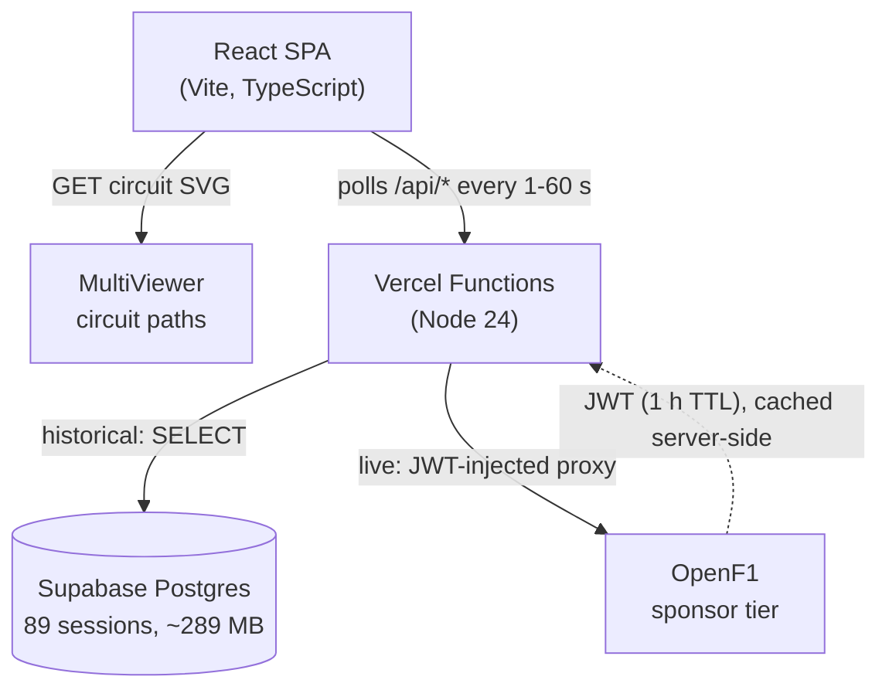

# F1 Live Tracker

**Real-time Formula 1 race tracker. Live driver positions on an SVG circuit map, broadcast-style timing tower, replay scrubber across 89 historical races.**

[**Try the tracker →**](https://f1-live-tracker.vercel.app)


https://github.com/user-attachments/assets/882b66b3-a962-4d6b-a722-1c3f2adda93c


---

## What it does

- Driver positions update **every second** on an SVG circuit map sized to each track's natural aspect ratio.
- Timing tower: gap to leader, current tire compound and age, last lap time with **fastest-lap purple**, and **per-sector micro-chips** (overall best, personal best, or slower).
- **Replay scrubber** across 89 historical race weekends from 2023 to 2025, with safety-car and red-flag event markers on the rail.
- **DNF, NC, and DNS classification** inferred from `/laps` data. OpenF1 does not expose a classification field, so the app derives it from lap-count gaps and duration timestamps.
- Live weather pill: air temperature plus a sky icon, with track temperature, humidity, and wind on hover.
- Race control feed (FIA messages, sector flags, safety-car deployments) in the header strip.

---

## Architecture



- **Frontend.** React SPA bundled by Vite. No framework router, one page. Eight typed data hooks (`useSession`, `usePositions`, `useLocations`, `useLaps`, `useStints`, `useRaceControl`, `useWeather`, `useCircuit`) own polling cadence and surface `{ data, loading, error }`.
- **Backend.** Vercel Serverless Functions in `api/`. Two responsibilities: read historical session data from Supabase, and proxy live OpenF1 calls with a server-cached JWT so the bearer token never reaches the browser.
- **Database.** Supabase Postgres. 89 race sessions ingested via `scripts/seed.ts` (2023 to 2025 Race and Sprint sessions, FK-constrained with `DEFERRABLE INITIALLY DEFERRED`).
- **External APIs.** OpenF1 paid sponsor tier (6 req/s, 60 req/min limit). MultiViewer for free SVG circuit-path data.

---

## Engineering highlights

### Polling and live-data architecture

**Eight typed hooks** in `src/hooks/`, each owns one polling concern: `useSession`, `useDrivers`, `usePositions`, `useLocations`, `useStints`, `useLaps`, `useRaceControl`, `useWeather`. Every hook returns `{ data, loading, error }` and pauses when `sessionKey` is null. Cadences sized to how often the underlying data actually changes:

| Endpoint                  | Cadence | What it drives                  |
| ------------------------- | ------- | ------------------------------- |
| `/location`               | 1 s     | Driver-dot positions on the map |
| `/position`, `/intervals` | 4 s     | Order and gap-to-leader         |
| `/race_control`           | 10 s    | FIA messages, flags, safety-car |
| `/laps`, `/stints`        | 30 s    | Lap times, tire compounds       |
| `/weather`                | 60 s    | Air/track temp, rainfall        |

All polling routes through a shared `useInterval` so no timer outlives its component (cleaned up on unmount). Live mode polls continuously. Historical replay does a one-shot fetch then idles. Driver-dot movement uses a `requestAnimationFrame` loop in replay that interpolates _along the SVG circuit path_ (not straight lines), and a CSS transition in live mode so the two animation strategies never compete.

### Database and ingest pipeline

**Supabase Postgres**, eight tables (`sessions`, `drivers`, `positions`, `intervals`, `stints`, `laps`, `race_control`, `locations`), all FK-constrained back to `sessions` with `DEFERRABLE INITIALLY DEFERRED` so multi-table inserts inside a transaction don't deadlock on insertion order. **89 race sessions seeded, ~289 MB.**

**Idempotent ingest** via unique-index + `ON CONFLICT DO NOTHING`. `scripts/seed.ts` is safe to re-run without duplicates. New tables added later get focused backfill scripts (`scripts/backfill-race-control.ts`, `scripts/patch-locations.ts`) following the same pattern. Per-driver, per-lap one-row-per-snapshot for location data (not raw 3.7 Hz telemetry) keeps the historical archive lean.

The seed runs on a **daily Vercel Cron** with two soft-skip classes:

- Future race weekends filtered upfront (`date_end < now()`) so the cron doesn't brick scheduled-but-unraced rows as "cancelled."
- Partial OpenF1 data (404 on `/position`) rolls the transaction back _without_ marking the session processed, so the next cron retries instead of leaving the table half-populated.

### Security

- **OpenF1 credentials never reach the browser.** The sponsor-tier flow is username + password to a JWT with a 1-hour TTL; the JWT is fetched on cold start inside `api/openf1-proxy.ts`, cached server-side, and injected as the `Authorization: Bearer` header before each request is forwarded. The SPA only ever sees `/api/openf1/<path>`.
- **`/api/token` is Origin-gated** by an allowlist of deployed domains, so a malicious site can't reuse the proxy to drain the rate limit.
- **Supabase service-role key is server-only.** Read by Vercel functions, never bundled into the client. Public anon key isn't used either (every read goes through an authenticated function).

### Rate limiting

OpenF1 sponsor tier caps at 6 req/s, 60 req/min. Cold-loading the page used to fire 7 concurrent requests on mount, breach the limit, and earn a 429 plus 60 seconds of back-off.

`App.tsx` stages the data hooks into **three priority tiers**, 200 ms apart:

- **Tier 1 (t=0):** drivers, positions, intervals. Renders the leaderboard immediately.
- **Tier 2 (t+200 ms):** stints, location stream. Tires and track map.
- **Tier 3 (t+400 ms):** laps, race control, weather.

Max concurrent requests in any 1-second window is 3, under the 6 req/s ceiling. `fetchWithRetry` in `src/api/openf1.ts` handles per-request **exponential backoff** on 429 so individual hooks recover gracefully if the ceiling is hit anyway.

### UI iteration

The interface was built component-first and iterated screenshot-by-screenshot (visible in the commit history as a series of chunked PRs). Notable evolutions:

- **Track map.** Started with a hardcoded `viewBox="0 0 800 500"`. Wide circuits like Miami and tall ones like Hungaroring letterboxed with dead-space wedges. Now the viewBox is computed per circuit from the actual bounds aspect ratio so every track fills its canvas tightly. SF marker brightened from a barely-visible 6 px icon.
- **Timing tower.** Padded gap decimals to 3 places, added a zero-gap guard (renders `—` when OpenF1 publishes a stale `0`), softened row dividers from `#222` to `rgba(255,255,255,0.04)`, sticky FL chip beside the holder's abbreviation, flash-on-set purple on the LAST LAP cell, three-bar sector micro-chips (overall best / personal best / slower).
- **StatusBar.** Killed three competing REPLAY indicators down to one. Race-control feed now snaps to word boundaries instead of CSS-clipping mid-word. Session title bumped 13 → 18 px, bar height 48 → 56 px. Added the weather pill (☀ / ☁ / 🌧 plus air temp, hover for track temp / humidity / wind).
- **Scrubber.** Filled rail desaturated from F1-brand `#E8002D` to neutral `#888` so it stopped dominating every screenshot from the bottom edge.
- **Driver dots.** Interpolate along the actual circuit path during scrub (not straight lines) so they never cut corners off-track.

### Stack decisions

- **No router.** Single-page SPA. The product is one view; a router would add weight for nothing.
- **No Redux / Zustand / React-Query.** State is local to hooks, derived via `useMemo`, and propagated by props. The polling cadence + memo invalidation is simple enough that a global store would obscure the dataflow.
- **`types/f1.ts` is the contract.** Every OpenF1 response shape is typed once; the API client, hook, and component all import from there. When OpenF1 added a new field this season, only the type file changed.
- **MultiViewer for circuit data** instead of OpenF1's `/v1/circuits` so the SVG path fetch doesn't burn the 6 req/s rate-limit budget.
- **In-memory location cache** on `api/location-snapshot.ts` (150-entry LRU) so the replay scrubber doesn't refetch OpenF1 every time the slider moves; debounce + cache hits keep prod under 1 req/s during heavy scrubbing.

---

## Development

```bash
npm install
npm run dev       # http://localhost:5173 (Vite + in-process API plugins)
npm run build     # tsc -b && vite build
npm run lint
```

`npm run dev` boots a single port. Vite's in-process middleware (`vite.config.ts`) mirrors the production Vercel functions for the OpenF1 proxy and location-snapshot endpoints, so you don't need `vercel dev` or a second port.

### Environment variables

```
OPENF1_USERNAME            # OpenF1 sponsor-tier email
OPENF1_PASSWORD            # OpenF1 sponsor-tier password
SUPABASE_URL               # Supabase project URL
SUPABASE_SERVICE_ROLE_KEY  # Backend only, never expose to the browser
DATABASE_URL               # Direct Postgres connection (for seed scripts)
```

### Seeding historical data

```bash
npm run seed                            # ingest /v1/sessions where year is 2023, 2024, or 2025
npm run patch-locations                 # backfill /v1/location snapshots per lap
tsx scripts/backfill-race-control.ts    # backfill /v1/race_control
```

---

## Project structure

```
api/                         # Vercel Functions (Node 24)
  openf1-proxy.ts            # JWT proxy. Injects bearer token, forwards to OpenF1.
  positions.ts, drivers.ts,  # Supabase-backed historical reads
  intervals.ts, stints.ts,
  laps.ts, race-control.ts,
  sessions.ts, location-snapshot.ts, live.ts
  token.ts                   # browser-safe token endpoint (no-op forwarder)
lib/shared.js                # rate-limit, IP extraction, auth helpers
db/schema.sql                # Postgres schema (sessions, drivers, laps, ...)
scripts/                     # seed and backfill scripts (tsx)
src/
  api/                       # typed REST clients (openf1.ts, backend.ts, ...)
  hooks/                     # one polling concern per file
  components/                # TrackMap, Leaderboard, StatusBar, ReplayScrubber, ...
  types/f1.ts                # every API response shape, no `any` anywhere
  utils/coordinates.ts       # normalizeCoords + bounds computation for the SVG map
  App.tsx                    # cutoff-aware orchestration hub
vercel.json                  # /api/openf1/<path> rewrite + function maxDuration
vite.config.ts               # dev plugins that mirror prod Vercel functions
CLAUDE.md                    # architecture + project rules for AI-assisted dev
```

---

## Credits

- **[OpenF1](https://openf1.org).** Live and historical F1 telemetry.
- **[MultiViewer](https://multiviewer.app).** Free SVG circuit-path data.
- Driver headshots and team colors © Formula 1, used for non-commercial display.

---

## License

MIT.
